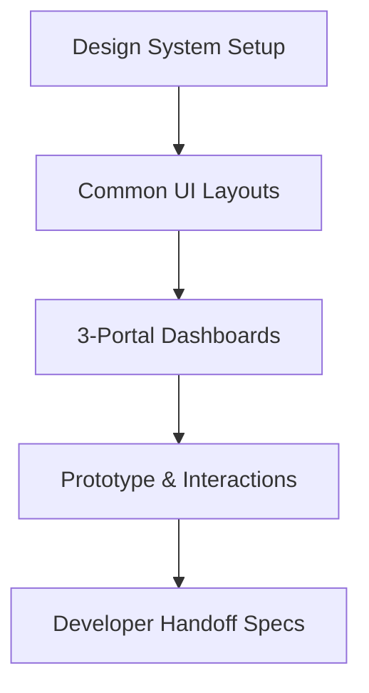

# CommerceIQ — Week 1 Implementation Plan

This document outlines the step-by-step implementation plan for **Week 1 (Foundation)** of the CommerceIQ platform. The goal is to set up a robust, working monorepo and database foundations, alongside a comprehensive **Figma Frontend Design Specification** to align stakeholders and lay down the visual foundations before coding.

---

## 1. Directory Structure (Turborepo + npm Workspaces)

We will set up a monorepo structure using **npm workspaces** and **Turborepo** to manage our apps and packages:

```
Smart-Inventory-Management-System/
├── apps/
│   ├── web/                     # Next.js 14 Frontend (App Router, TS, Tailwind, shadcn/ui)
│   ├── api/                     # NestJS Core Backend (REST API, Prisma Client)
│   └── ml-service/              # FastAPI ML Microservice (Python 3.13)
├── packages/
│   ├── database/                # Prisma schema & database clients
│   └── shared-types/            # Shared TypeScript interfaces (DTI, role guards)
```

---

## 2. Figma Frontend Design Specification (Week 1 Focus)

To ensure high-fidelity aesthetics, responsiveness, and consistent UX across all three portals, the frontend will be fully designed and prototyped in **Figma** during Week 1 before starting coding in Week 2.



### 2.1 Design System & Component Library (Figma Assets)

We will establish a modern, enterprise-grade design system in Figma using auto-layout, components, and variants.

#### 🎨 Color System (Sleek Dark Mode & Harmonious Light Mode)
*   **Primary (Brand):** Deep Indigo `#3F51B5` / Slate Blue `#4F46E5`
*   **Secondary:** Teal `#0D9488` (for success, positive trend metrics)
*   **Neutral Dark (Backgrounds):** Rich Charcoal `#0F172A` / `#1E293B`
*   **Neutral Light (Backgrounds):** Soft Gray `#F8FAFC` / Pure White `#FFFFFF`
*   **Accents:** Crimson `#EF4444` (critical anomalies, stockout warnings), Amber `#F59E0B` (forecast warnings, pending approvals)

#### ✍️ Typography & Hierarchy
Using a clean sans-serif typeface (e.g., **Inter** or **Outfit**):
*   **H1 (Display):** 32px / Bold (Dashboard main metrics)
*   **H2 (Headers):** 24px / Semi-Bold (Section headings)
*   **H3 (Subheaders):** 18px / Medium (Card titles, table headers)
*   **Body (Regular):** 14px / Regular (Table content, descriptions)
*   **Small / Caption:** 12px / Medium (Badges, timeline stamps)

#### 🧩 Reusable UI Components (Variants & Auto-Layout 5.0)
*   **Buttons:** Primary, Secondary, Outline, Danger (States: Default, Hover, Active, Disabled, Loading).
*   **Input Fields:** Text, Select, Search, Date Range Picker (with error states, helpers, and icons).
*   **Navigation:** Sidebar navigation items (Active, Inactive, Collapsed states).
*   **Data Tables:** Header cells, body rows (with hover states), sort indicators, and pagination.
*   **KPI Cards:** Value, trend indicator (+/- %), Sparkline placeholder, and action dropdown.

---

### 2.2 Portal Shell Layouts & Responsive Grids

All screen designs will follow a layout grid to guarantee flawless responsive translation.

| Portal | Layout Style | Grid Specifications | Key Views to Design (Week 1) |
|---|---|---|---|
| **Admin Portal** | Collapsible Sidebar + Core Workspace | 12-Column Grid (Desktop: 1440px, 24px gutters) | Main Dashboard, Product Catalog, Category tree, Supplier detail sheet |
| **Distributor Portal** | Left-Navigation + Action Area | 12-Column Grid (Desktop: 1440px, 24px gutters) | Order Management, Inventory levels, Credit Limits dashboard |
| **Buyer Portal** | Top-Nav Navigation + Grid List | 12-Column Grid (Desktop) / 4-Column (Mobile) | Product Browsing, Cart/Checkout screen, Purchase Orders |

---

### 2.3 Week 1 User Flow & Mockup Deliverables

The Figma project will consist of the following screen mockups by Friday:

#### 1. Authentication & Security Flow
*   **Login Page:** Clean, center-aligned card layout with brand vector illustration. Includes fields for Email, Password, and a "Remember Me" toggle.
*   **Multi-Factor Auth (MFA):** One-time passcode (OTP) verification screen.
*   **Forgot Password:** Step-by-step password recovery flow.

#### 2. Admin Portal Core Dashboard
*   **Navigation Shell:** Sidebar featuring Catalog, Inventory, Suppliers, AI Insights, Invoices, Settings.
*   **Inventory Catalog View:** Tabular listing of SKUs showing image, name, category, warehouse location, stock level, status badge (In Stock, Low Stock, Out of Stock), and an "Actions" dropdown.
*   **Product Drawer:** Right-aligned slide-out drawer containing full product details, supplier info, and transaction history.

#### 3. Distributor Portal Shell
*   **Distributor Dashboard:** Highlight cards for total stock, pending orders, and credit terms.
*   **Wholesale Catalog View:** Grid representation of items available for wholesale purchase.

#### 4. Buyer Portal Shell
*   **Procurement Screen:** Interactive grid listing items with price breaks (tiered pricing representation).
*   **B2C-style B2B Checkout:** Order summary list, delivery selection, and payment options.

---

### 2.4 Prototyping & Interaction Details

To wow the stakeholders during the Week 1 demo, we will implement the following micro-animations and transition prototypes inside Figma:
*   **Sidebar Transition:** Smart-animate sidebar toggle (expanded to collapsed, 200ms ease-in-out).
*   **Hover states:** Smooth shadow transitions and color shifts on KPI cards and list rows (150ms ease-out).
*   **Authentication Flow:** Seamless step transitions from Login to OTP verification.
*   **Product Drawer:** Slide-in from right (300ms ease-out) with overlay background fade.

---

### 2.5 Developer Handoff Checklist

Before handing the designs off to the development phase in Week 2, the frontend team will verify that:
1.  **Figma Styles:** All colors, typography, shadows, and spacing variables are linked to Figma Local Styles.
2.  **Auto-Layout:** 100% of layout groups utilize Auto-Layout (no absolute positioning unless mathematically necessary) to ensure clean CSS/Tailwind translation.
3.  **Naming Convention:** Components match shadcn/ui nomenclature (`Button`, `Input`, `Table`, `Dialog`, etc.) to streamline development.
4.  **Dev Mode Setup:** Annotations, spacing guides, and exportable assets (SVGs, brand marks) are fully configured and accessible in Figma Dev Mode.

---

## 3. Week 1 Implementation Steps (BE & ML Alignments)

While Frontend is finalizing Figma designs:
*   **BE:** Monorepo setup (Turborepo), initial DB schemas, Prisma migrations, and mock API endpoints.
*   **ML:** FastAPI setup, embedding model selection, and synthetic data generation tools.
